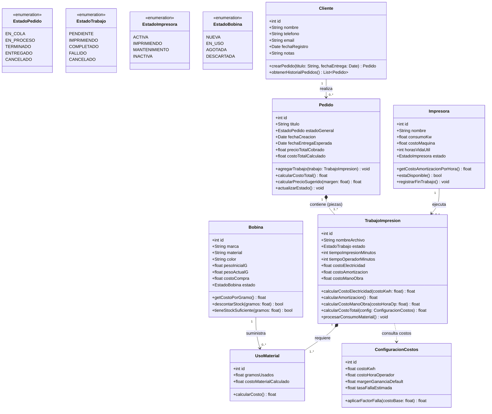

# Modelo de Dominio y Diagrama de Clases - Granja de Impresión 3D

Este directorio contiene la arquitectura y el diagrama de clases para el sistema de gestión de la granja de impresión 3D (adaptado a los datos y flujos de **Bambu Studio**).

---

## Archivos Generados para Descarga y Uso

| Archivo | Descripción | Uso |
| :--- | :--- | :--- |
| [`diagrama_clases.html`](file:///c:/Users/augus/Desktop/MendoDeco/diagrama_clases.html) | **Visor interactivo en el navegador** | Haz doble clic para abrir en Chrome/Edge. Incluye botones directos para **Descargar en SVG**, **Descargar en PNG** e **Imprimir / Guardar como PDF**. |
| [`diagrama_clases.mmd`](file:///c:/Users/augus/Desktop/MendoDeco/diagrama_clases.mmd) | **Código fuente Mermaid** | Ideal para importar en [Mermaid Live Editor](https://mermaid.live), Notion, Obsidian, GitHub o Draw.io. |

---

## Diagrama de Clases

